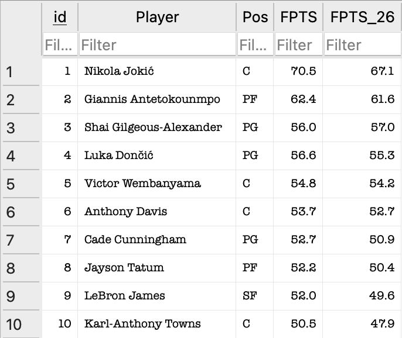

## Fantasy-Draft-Predictor

### Overview

- A machine learning tool to help predict fantasy basketball draft performance.
- Uses past 5 seasons of NBA player stats to train a linear regression model that forecasts fantasy points (FPTS) for the upcoming 2026 season.
- Outputs a sorted CSV of predicted fantasy points for all players to assist with drafting players.

---

### Results



---

### Requirements

- Install dependencies:
```bash
pip install -r requirements.txt
```

---

### Running the Program

#### Running the Frontend

1. Run the command
```bash
python3 main.py
```
2. Results will be saved to `data/2026season_prediction.csv`

---